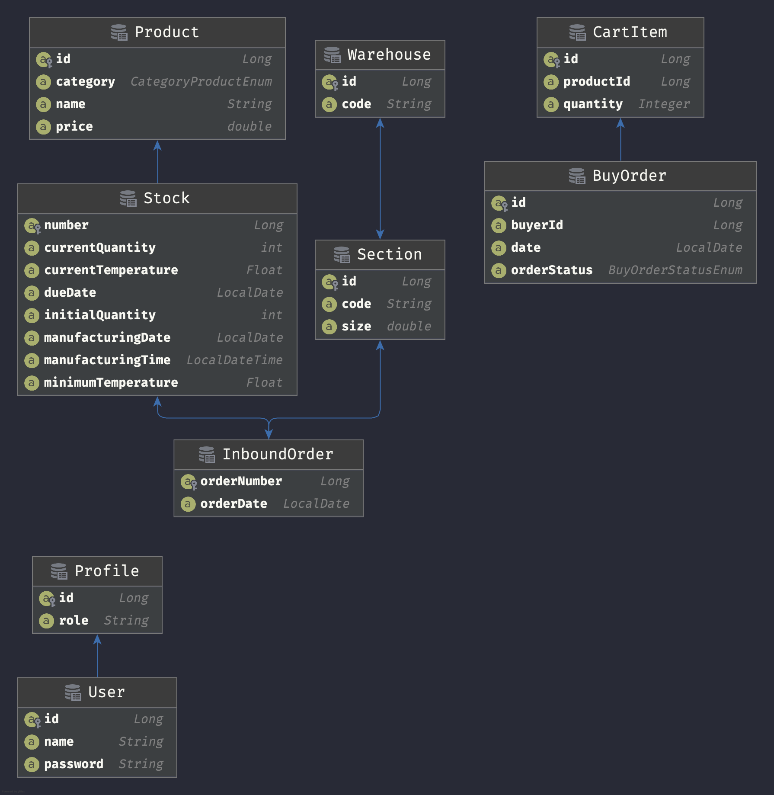

#Entity–relationship model

Down bellow we have the current DER for this project.



The file was autogenerated by the persistence plugin in IntelliJ Ultimate version.

#Security - JWT

``/auth``

For this application, we used the JWT strategy to authenticate and provide access to the user on a given route.
The current roles for access on the application are ```manager``` and ``seller``.
More info on the swagger file.

#Database
For this project, each developer created an application on fury with it's own schema and cluster. 

- Schema: exampleschema
- Cluster: examplecluster

#User Stories

For all the user stories we will provide a small description mentioning impact on the application, as well as it's corresponding route.
Also, for the commit history of the project, each user story was developed on a different git branch.

Additional information about all the routes of the application can be found on the swagger.yaml file.

### US-01:ml-insert-batch-in-fulfillment-warehouse

``/api/v1/fresh-products/inboundorder/``

The manager of a warehouse can insert or update an existing Stock of products.

### US-02:ml-add-products-to-cart
``/api/v1/fresh-products/``

``/api/v1/fresh-products/list``

``/api/v1/fresh-products/orders/``

The seller can create a new cart with desired products, and get the total value of the purchase.
He also can list all the current products as well the related categories for each one.

### US-03:ml-check-product-location-in-warehouse

``/api/v1/fresh-products/list?querytype=[idProducto]querytype=[C]``

The manager of the warehouse can look for a product in a provided stock, order by due date or total quantity.

### US-04:ml-check-product-stock-in-warehouses

``/api/v1/fresh-products/warehouse/``

The manager of the warehouse can look up for a product inside all the warehouses, and know how much of stock the desired
product has inside each warehouse.


### US-05:ml-check-batch-stock-due-date

``api/v1/fresh-products/due-date/``

``api/v1/fresh-products/due-date/list``

The seller can search for a product, inside all the warehouses, that have a due date close do expire, 
and with that list he can execute any kind of promotion strategy to sell them as fast as possible.